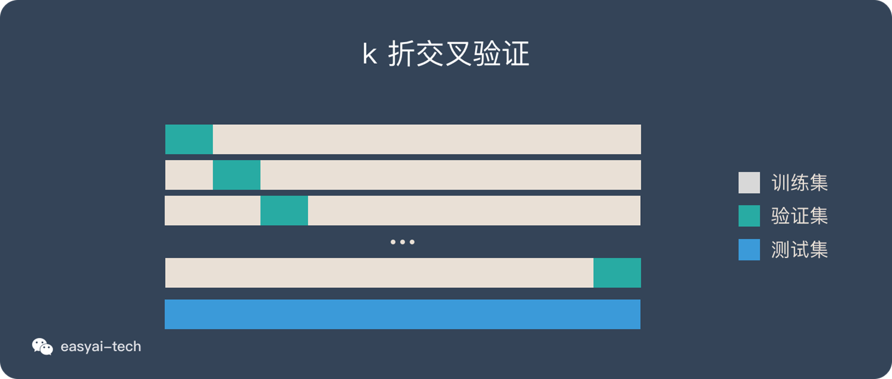
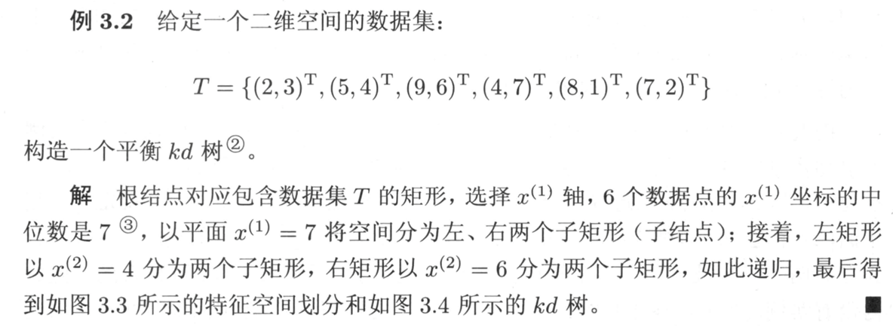
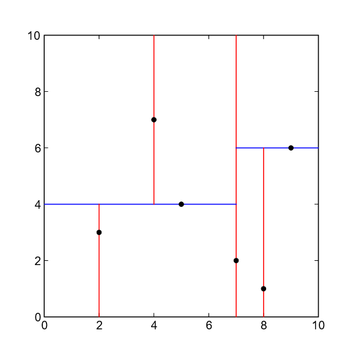
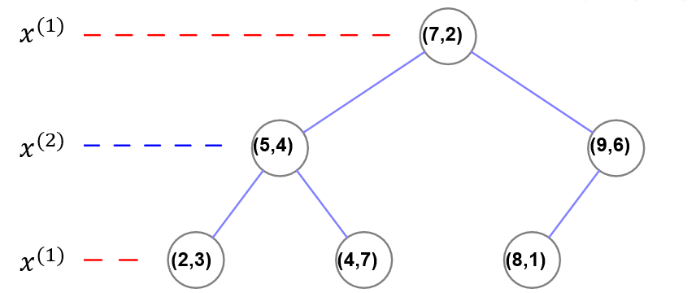
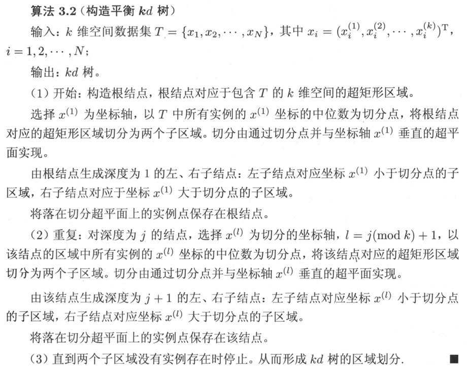
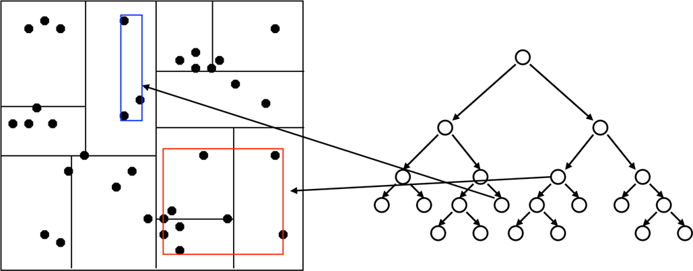
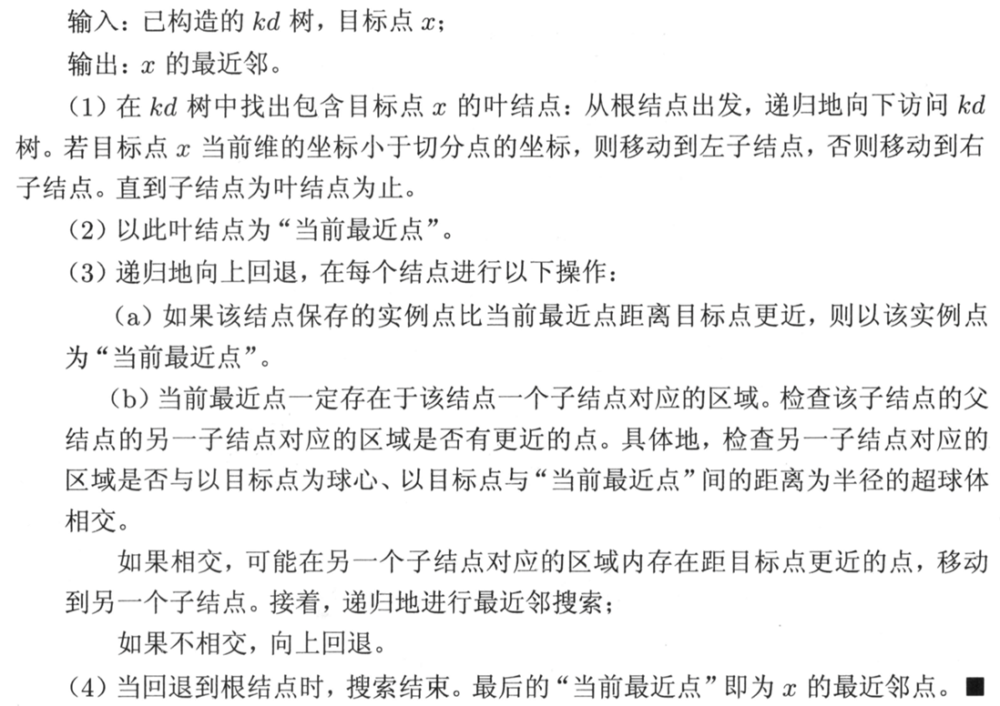
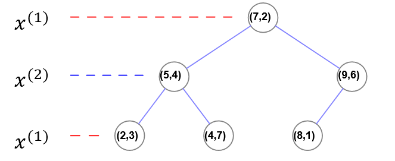
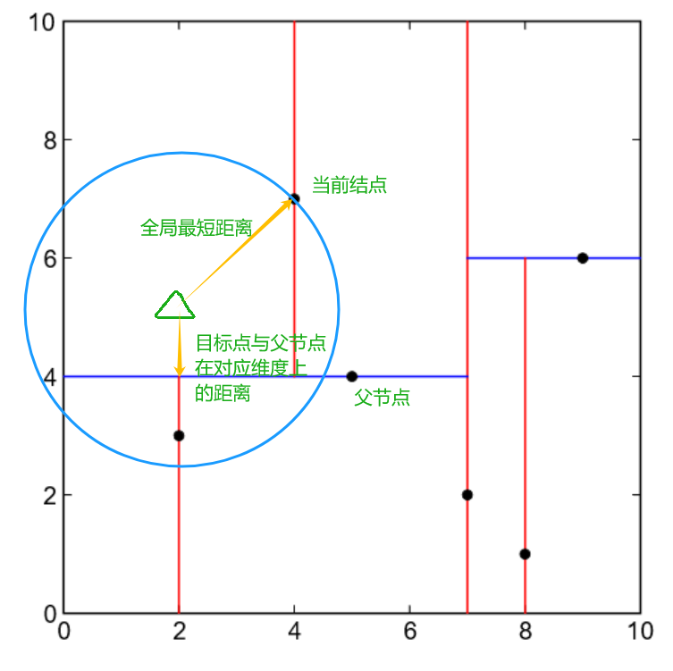
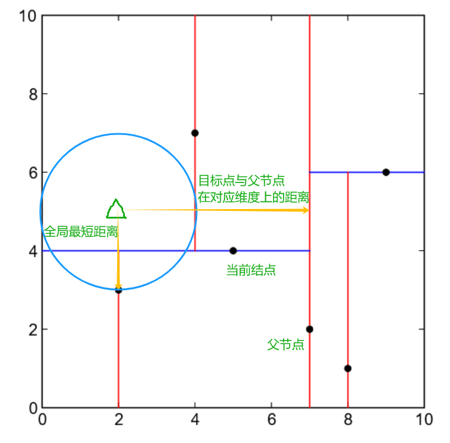

# 1 概述

## 机器学习系统的种类

*机器学习的本质：学习一个从数据X到数据Y的映射*

### 有无监督

- 监督式学习：回归、分类。**训练样本和标签的集合作为经验**
- 无监督式学习：聚类、可视化和降维、异常检测、关联规则
- 半监督式学习：大量非标注数据和少量的标记数据
- 强化学习：智能体（agent）通过行为/动作（action），获取奖励/惩罚（rewrds/panalties），存在策略。**计算机与环境互动获得经验**

### 能否动态地进行增量学习

- 在线学习（增量学习）：系统可以从传入的数据流中进行增量学习。循序渐进地给系统提供训练数据，逐步积累学习成果。整个过程通常是**离线**完成的*（不在live系统上）*，因此在线学习这个名字很容易让人误解，用增量学习更为合适。
- 离线学习（批量学习）：系统无法进行增量学习，必须使用所有数据进行训练。对于新数据，需要将老数据和新数据合并，然后一起重新训练一个新版本的系统，停用旧系统。

### 基于实例/模型

- 基于实例的学习：死记硬背，系统先完全记住学习示例，然后通过某种相似的度量方式将其泛化到新的实例。
- 基于模型的学习：从一组示例集中学习出构建这些示例的模型，然后使用该模型进行预测。

## 机器学习的基本步骤

*数据和特征决定了机器学习的上界，而模型和算法只是去逼近这个上界。*

（收集数据-输入数据-数据预处理-训练和测试模型-模型的评估）

**加载数据-训练/测试集切分-数据预处理-创建模型-模型拟合-预测-评估模型性能-模型调整**

- 数据的分类
    - 结构化数据和非结构化数据。结构化数据是二维表结构，非结构化数据是图片、文字、语音和视频等。
    - 原始数据和加工数据。
    - 样本内数据和样本外数据。

- 模型评估：

    - 混淆矩阵

        |          | 实际正例 | 实际负例 |
        | -------- | -------- | -------- |
        | 预测正例 | TP       | FP       |
        | 预测负例 | FN       | TN       |

        T:True       F:False		机器的判断是否正确

        P:Positive N:Negative	 机器预测样本为正还是负

    - 准确率

        $Accuracy = \frac{TP+TN}{TP+TN+FP+FN}$

        - 判断正确数量/全部数量

        - 代表了对样本整体的预测准确程度

        - **在样本不平衡的情况下，准确率会失效**

    - 精确率

        $Precision = \frac{TP}{TP+FP}$

        - 预测为正的样本中实际为正的概率

        - 代表了对正样本结果中的预测准确程度

    - 召回率（查全率）

        $Recall = \frac{TP}{TP+FN}$

        - 实际为正的样本中被预测为正的概率

        - 适用于网贷违约的坏用户检测等场景

    - F1分数

        $F1 = \frac{2 \times Precision \times Recall}{Precision + Recall}$ 

        - 精确率和召回率的加权平均数，综合考虑了精确率和召回率

            $\frac{2}{\frac{1}{Precision}+\frac{1}{Recall}}$

    - ROC曲线

        接受者操作特征曲线

    - AUC曲线

        曲线下面积

- 交叉验证法

    - 留出法

        - 按固定比例将数据集**静态**地划分为训练集、验证集、测试集

            > 对于小规模样本集（几万量级），常用的分配比例是 60% 训练集、20% 验证集、20% 测试集
            >
            > 对于大规模样本集（百万级以上），只要验证集和测试集的数量足够即可，例如有 100w 条数据，那么留 1w 验证集，1w 测试集即可。1000w 的数据，同样留 1w 验证集和 1w 测试集
            >
            > 超参数越少，或者超参数很容易调整，那么可以减少验证集的比例，更多的分配给训练集

    - 留一法

        - 每次的测试集都只有一个样本，要进行 m 次训练和预测

            这个方法用于训练的数据只比整体数据集少了一个样本，因此最接近原始样本的分布

            但是训练复杂度增加了，因为模型的数量与原始数据样本数量相同

            一般在数据缺乏时使用

    - k折交叉验证

        - **动态**地进行验证

            > 将数据集分为训练集和测试集，将测试集放在一边
            >
            > 将训练集分为 k 份
            >
            > 每次使用 k 份中的 1 份作为验证集，其他全部作为训练集。
            >
            > 通过 k 次训练后，我们得到了 k 个不同的模型。
            >
            > 评估 k 个模型的效果，从中挑选效果最好的超参数
            >
            > 使用最优的超参数，然后将 k 份数据全部作为训练集重新训练模型，得到最终模型

​				

k一般取10。数据量小的时候，k 可以设大一点，这样训练集占整体比例就比较大，不过同时训练的模型个数也增多。 数据量大的时候，k 可以设小一点。测试集单独拿出来，千万不能用测试数据来调参。

- 模型调整（调参）：网格搜索/随机搜索。

    如果搜索空间包含 3 到 4 个以上的维度，不要使用网格搜索。相反，使用随机搜索，它为每个搜索任务提供了非常好的基准

# 2 KNN

## KNN的工作机制

确定训练样本以及某种距离度量。对于某个给定的测试样本，找到训练集中距离最近的K个样本。分类问题用投票法，回归问题用平均法。还可以基于距离远近进行加权平均或加权投票，距离越近的样本权重越大。

- 投票法：选择k个样本中出现最多的类别标记作为预测结果
- 平均法：将这k个样本的实值输出标记的平均值作为预测结果
- KNN没有显式的学习过程。
- K=1时，称为最邻近算法。

## 距离度量

特征空间中两个实例点的距离是两个实例点相似程度的反映。不同的距离度量所确定的最近邻点可能是不同的。

闵可夫斯基距离：$L_p(x_i,x_j) = (\sum^n_{l=1}|x_i^{(l)}-x_j^{(l)}|^p)^\frac{1}{p}$ 

$p=1$，曼哈顿距离

$p=2$，欧氏距离

$p=\infty$，切比雪夫距离。各个坐标距离的最大值。原式会变为$\max\limits_{l}|x_i^{(l)}-x_j^{(l)}|$

## K值的选择

- K值的选择会对k近邻法的结果产生重大影响

- 为了避免平票的出现，k应该选择**奇数**

- K值小：单个样本的影响越大
    - 优点：近似误差（approximation error）减小
        - 只有与输入实例较近的训练实例才会对预测结果起作用
    - 缺点：估计误差（estimation error）增大
        - 预测结果会对近邻的实例点非常敏感（易受噪声影响）

- K值大：单个样本的影响越小

    - 优点：估计误差减小

    - 缺点：近似误差增大

- 通常采用**交叉验证法**来选取最优的K值（调参）

## 特征缩放

- 线性归一化

    Min-Max 归一化，结果值映射到$[0,1]$
    $$
    x = \frac{x-x_{min}}{x_{max}-x_{min}}
    $$
    补充：将数据归一化到$[a,b]$区间：
    $$
    k = \frac{(b-a)}{x_{max}-x_{min}} \\
    x = a + k(x-x_{min})
    $$

- 

- 标准差标准化

$$
x = \frac{x-\mu}{\sigma}
$$

特征缩放的作用：

- 提升模型的收敛速度（加快梯度下降的求解速度）

- 提升模型的精度（消除量级和量纲的影响）
- 简化计算（与归一化的简化原理相同）

## KD树

寻找k近邻时，可以采用线性扫描：计算输入实例与每一个训练实例的距离。复杂度$O(n)$。但当训练集很大时，计算非常耗时。

故采用**KD树**优化，提高K近邻搜索的效率。平均计算复杂度$O(\log N)$

### KD树的构造

- KD树是一棵平衡二叉树。若它的左子树不空，则左子树上所有结点的值均小于它的根结点的值； 若它的右子树不空，则右子树上所有结点的值均大于它的根结点的值

> 例：
> 
> 
> 

拓展到K维，其实是一样的。

- 通常，从方差较大的轴开始选择分割点。

- KD树上的每个叶子节点可以包含多个数据点

    

### KD树的搜索

重点说一下(3)(b)如何实现。实际上这个“超球”相交，只不过是看**当前搜索维度下的当前搜索结点与目标点的距离**是否小于**全局最优距离**。若小于，则相交。

还是举上面的例子。假设我们要查找的目标点为(2,5)

1. 从根结点出发

2. 在维度1，2<7，进入左子树(5,4)。

3. 在维度2，5>4，进入右子树(4,7)

4. 在维度1，2<4，进入左子树

    左子树为空，返回(4,7)

    当前最近点(4,7)，全局最短距离2.28

5. 检查**父节点**，即（5,4），在**维度2**上与目标点的距离。

    为1，小于全局最短距离2.28。*（说明超球与超平面相交了）*

    所以在父节点的左子树中对应的空间中**可能**存在距离目标点更近的点。

    所以需要进入这个节点(2,3)，并重复上面步骤。

    

6. 当前最近点(2,3)：全局最短距离1.41

    在维度1，2>=2，进入右子树

    右子树为空，返回(2,3)

7. 返回(5,4)

8. 检查**父节点**，即（7,2），在**维度1**上与目标点的距离。

    为5，大于全局最短距离1.41。*（说明超球与超平面没有相交）*

    所以在父节点的右子树中结点对应的空间中**不可能**存在更近的点。

    

9. 以此类推，直到回到根节点（包括对根节点另一侧的判断）。

# 3 朴素贝叶斯

