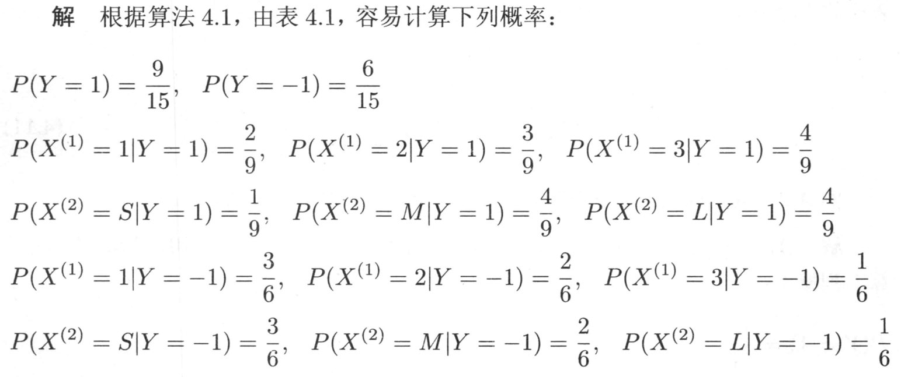
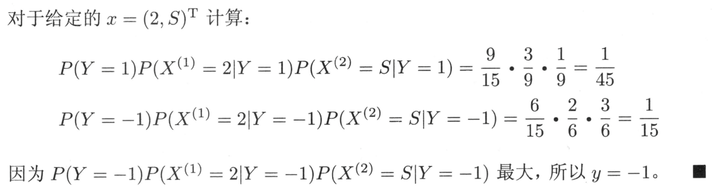
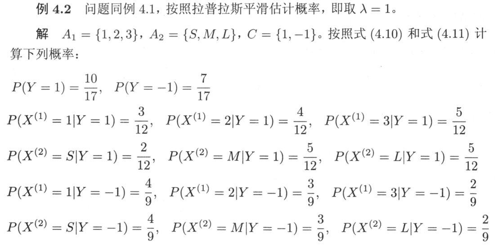
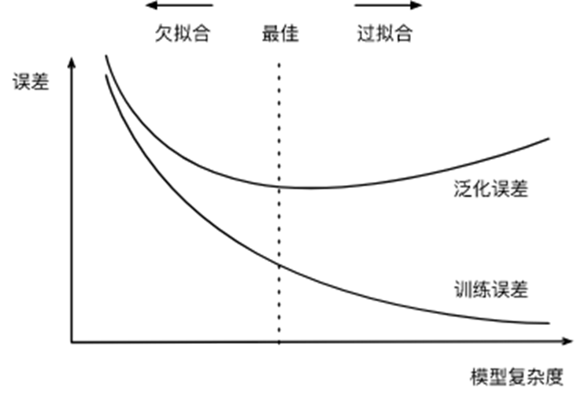
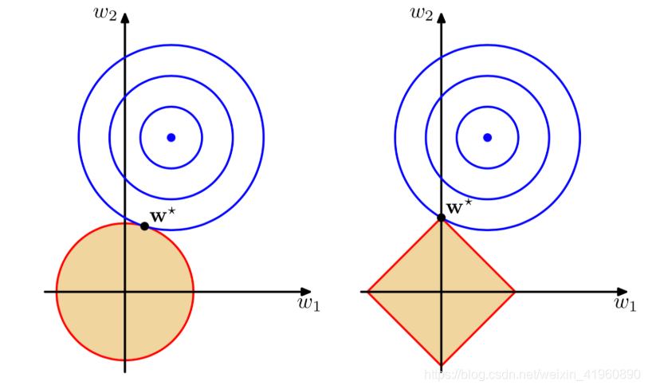

# 1 概述

## 机器学习系统的种类

*机器学习的本质：学习一个从数据X到数据Y的映射*

### 有无监督

- 监督式学习：回归、分类。**训练样本和标签的集合作为经验**
- 无监督式学习：聚类、可视化和降维、异常检测、关联规则
- 半监督式学习：大量非标注数据和少量的标记数据
- 强化学习：智能体（agent）通过行为/动作（action），获取奖励/惩罚（rewrds/panalties），存在策略。**计算机与环境互动获得经验**

### 能否动态地进行增量学习

- 在线学习（增量学习）：系统可以从传入的数据流中进行增量学习。循序渐进地给系统提供训练数据，逐步积累学习成果。整个过程通常是**离线**完成的*（不在live系统上）*，因此在线学习这个名字很容易让人误解，用增量学习更为合适。
- 离线学习（批量学习）：系统无法进行增量学习，必须使用所有数据进行训练。对于新数据，需要将老数据和新数据合并，然后一起重新训练一个新版本的系统，停用旧系统。

### 基于实例/模型

- 基于实例的学习：死记硬背，系统先完全记住学习示例，然后通过某种相似的度量方式将其泛化到新的实例。
- 基于模型的学习：从一组示例集中学习出构建这些示例的模型，然后使用该模型进行预测。

## 机器学习的基本步骤

*数据和特征决定了机器学习的上界，而模型和算法只是去逼近这个上界。*

（收集数据-输入数据-数据预处理-训练和测试模型-模型的评估）

**加载数据-训练/测试集切分-数据预处理-创建模型-模型拟合-预测-评估模型性能-模型调整**

- 数据的分类
    - 结构化数据和非结构化数据。结构化数据是二维表结构，非结构化数据是图片、文字、语音和视频等。
    - 原始数据和加工数据。
    - 样本内数据和样本外数据。

- 模型评估：

    - 混淆矩阵

        |          | 实际正例 | 实际负例 |
        | -------- | -------- | -------- |
        | 预测正例 | TP       | FP       |
        | 预测负例 | FN       | TN       |

        T:True       F:False		机器的判断是否正确

        P:Positive N:Negative	 机器预测样本为正还是负

    - 准确率

        $Accuracy = \frac{TP+TN}{TP+TN+FP+FN}$

        - 判断正确数量/全部数量

        - 代表了对样本整体的预测准确程度

        - **在样本不平衡的情况下，准确率会失效**

    - 精确率

        $Precision = \frac{TP}{TP+FP}$

        - 预测为正的样本中实际为正的概率

        - 代表了对正样本结果中的预测准确程度

    - 召回率（查全率）

        $Recall = \frac{TP}{TP+FN}$

        - 实际为正的样本中被预测为正的概率

        - 适用于网贷违约的坏用户检测等场景

    - F1分数

        $F1 = \frac{2 \times Precision \times Recall}{Precision + Recall}$ 

        - 精确率和召回率的加权平均数，综合考虑了精确率和召回率

            $\frac{2}{\frac{1}{Precision}+\frac{1}{Recall}}$

    - ROC曲线

        接受者操作特征曲线

    - AUC曲线

        曲线下面积

- 交叉验证法

    - 留出法

        - 按固定比例将数据集**静态**地划分为训练集、验证集、测试集

            > 对于小规模样本集（几万量级），常用的分配比例是 60% 训练集、20% 验证集、20% 测试集
            >
            > 对于大规模样本集（百万级以上），只要验证集和测试集的数量足够即可，例如有 100w 条数据，那么留 1w 验证集，1w 测试集即可。1000w 的数据，同样留 1w 验证集和 1w 测试集
            >
            > 超参数越少，或者超参数很容易调整，那么可以减少验证集的比例，更多的分配给训练集

    - 留一法

        - 每次的测试集都只有一个样本，要进行 m 次训练和预测

            这个方法用于训练的数据只比整体数据集少了一个样本，因此最接近原始样本的分布

            但是训练复杂度增加了，因为模型的数量与原始数据样本数量相同

            一般在数据缺乏时使用

    - k折交叉验证

        - **动态**地进行验证

            > 将数据集分为训练集和测试集，将测试集放在一边
            >
            > 将训练集分为 k 份
            >
            > 每次使用 k 份中的 1 份作为验证集，其他全部作为训练集。
            >
            > 通过 k 次训练后，我们得到了 k 个不同的模型。
            >
            > 评估 k 个模型的效果，从中挑选效果最好的超参数
            >
            > 使用最优的超参数，然后将 k 份数据全部作为训练集重新训练模型，得到最终模型

​				

k一般取10。数据量小的时候，k 可以设大一点，这样训练集占整体比例就比较大，不过同时训练的模型个数也增多。 数据量大的时候，k 可以设小一点。测试集单独拿出来，千万不能用测试数据来调参。

- 模型调整（调参）：网格搜索/随机搜索。

    如果搜索空间包含 3 到 4 个以上的维度，不要使用网格搜索。相反，使用随机搜索，它为每个搜索任务提供了非常好的基准

# 2 KNN

## KNN的工作机制

确定训练样本以及某种距离度量。对于某个给定的测试样本，找到训练集中距离最近的K个样本。分类问题用投票法，回归问题用平均法。还可以基于距离远近进行加权平均或加权投票，距离越近的样本权重越大。

- 投票法：选择k个样本中出现最多的类别标记作为预测结果
- 平均法：将这k个样本的实值输出标记的平均值作为预测结果
- KNN没有显式的学习过程。
- K=1时，称为最邻近算法。

## 距离度量

特征空间中两个实例点的距离是两个实例点相似程度的反映。不同的距离度量所确定的最近邻点可能是不同的。

闵可夫斯基距离：$L_p(x_i,x_j) = (\sum^n_{l=1}|x_i^{(l)}-x_j^{(l)}|^p)^\frac{1}{p}$ 

$p=1$，曼哈顿距离

$p=2$，欧氏距离

$p=\infty$，切比雪夫距离。各个坐标距离的最大值。原式会变为$\max\limits_{l}|x_i^{(l)}-x_j^{(l)}|$

## K值的选择

- K值的选择会对k近邻法的结果产生重大影响

- 为了避免平票的出现，k应该选择**奇数**

- K值小：单个样本的影响越大
    - 优点：近似误差（approximation error）减小
        - 只有与输入实例较近的训练实例才会对预测结果起作用
    - 缺点：估计误差（estimation error）增大
        - 预测结果会对近邻的实例点非常敏感（易受噪声影响）

- K值大：单个样本的影响越小

    - 优点：估计误差减小

    - 缺点：近似误差增大

- 通常采用**交叉验证法**来选取最优的K值（调参）

## 特征缩放

- 线性归一化

    Min-Max 归一化，结果值映射到$[0,1]$
    $$
    x = \frac{x-x_{min}}{x_{max}-x_{min}}
    $$
    补充：将数据归一化到$[a,b]$区间：
    $$
    k = \frac{(b-a)}{x_{max}-x_{min}} \\
    x = a + k(x-x_{min})
    $$

- 

- 标准差标准化

$$
x = \frac{x-\mu}{\sigma}
$$

特征缩放的作用：

- 提升模型的收敛速度（加快梯度下降的求解速度）

- 提升模型的精度（消除量级和量纲的影响）
- 简化计算（与归一化的简化原理相同）

## KD树

寻找k近邻时，可以采用线性扫描：计算输入实例与每一个训练实例的距离。复杂度$O(n)$。但当训练集很大时，计算非常耗时。

故采用**KD树**优化，提高K近邻搜索的效率。平均计算复杂度$O(\log N)$

### KD树的构造

- KD树是一棵平衡二叉树。若它的左子树不空，则左子树上所有结点的值均小于它的根结点的值； 若它的右子树不空，则右子树上所有结点的值均大于它的根结点的值

> 例：
> 
> 
> 

拓展到K维，其实是一样的。

- 通常，从方差较大的轴开始选择分割点。

- KD树上的每个叶子节点可以包含多个数据点

    

### KD树的搜索

重点说一下(3)(b)如何实现。实际上这个“超球”相交，只不过是看**当前搜索维度下的当前搜索结点与目标点的距离**是否小于**全局最优距离**。若小于，则相交。

还是举上面的例子。假设我们要查找的目标点为(2,5)

1. 从根结点出发

2. 在维度1，2<7，进入左子树(5,4)。

3. 在维度2，5>4，进入右子树(4,7)

4. 在维度1，2<4，进入左子树

    左子树为空，返回(4,7)

    当前最近点(4,7)，全局最短距离2.28

5. 检查**父节点**，即（5,4），在**维度2**上与目标点的距离。

    为1，小于全局最短距离2.28。*（说明超球与超平面相交了）*

    所以在父节点的左子树中对应的空间中**可能**存在距离目标点更近的点。

    所以需要进入这个节点(2,3)，并重复上面步骤。

    

6. 当前最近点(2,3)：全局最短距离1.41

    在维度1，2>=2，进入右子树

    右子树为空，返回(2,3)

7. 返回(5,4)

8. 检查**父节点**，即（7,2），在**维度1**上与目标点的距离。

    为5，大于全局最短距离1.41。*（说明超球与超平面没有相交）*

    所以在父节点的右子树中结点对应的空间中**不可能**存在更近的点。

    

9. 以此类推，直到回到根节点（包括对根节点另一侧的判断）。

# 3 朴素贝叶斯

## 贝叶斯原理

朴素贝叶斯公式如下
$$
P(Y|X) = P(Y)\frac{P(X|Y)}{P(X)}
$$

$$
P(Y_i|X) = P(Y_i)\frac{P(X|Y_i)}{\Sigma_{i=1}^n P(X|Y_i)P(Y_i)}
$$

$P(Y)$称为先验概率（prior probability），即在Y事件发生之前，我们对Y事件概率的一个判断；

$P(X)$边际似然度；

$P(Y|X)$称为后验概率（posterior probability），即在X事件发生之后，我们对Y事件概率的重新评估；

$P(X|Y)$​似然度。

$\frac{P(X∣Y)}{P(X)}$​ 称为可能性函数（Likely hood），这是一个调整因子，使得预估概率更接近真实概率。

所以条件概率可以理解为：后验概率 = 先验概率 × 调整因子

- 如果"可能性函数">1，意味着"先验概率"被增强，事件Y的发生的可能性变大；
- 如果"可能性函数"=1，意味着X事件无助于判断事件A的可能性；
- 如果"可能性函数"<1，意味着"先验概率"被削弱，事件Y的可能性变小。

而高斯贝叶斯是先验为高斯分布的朴素贝叶斯，假设每个标签的数据都服从简单的正态分布。
$$
P(X_j=x_j|Y=C_k)=\frac{1}{\sqrt{2\pi \sigma^2_k}}exp(-\frac{(x-\mu_k)^2}{2\sigma_k^2})
$$
其中，$C_k$为$Y$的第$k$类的类别。$\mu_k$和$\sigma_k^2$为需要从训练集估计的值。

## 基本方法

训练数据集，假设X,Y**独立同分布**。

- 条件独立性假设：
    $$
    P(X|Y_i)=P(X^{(1)} = x^{(1)},...,X^{(n)}=x^{(n)}|Y=i) \\ =\mathop{\Pi}\limits_{j=1}\limits^{n} P(X^{(j)} = x^{(j)}|Y = i )
    $$
    用于分类的特征在类确定的条件下都是条件独立的。也是**朴素**一词的由来。

- 同分布：获取的观测数据是对总体的一个抽样。我们希望抽样尽可能地和总体相似，也就是服从相同的分布。即：抽样内样本服从总体的分布。

后验概率计算根据贝叶斯定理进行
$$
P(Y_i|X) = P(Y_i)\frac{P(X|Y_i)}{\Sigma_{i=1}^n\big(P(Y_i)P(X|Y_i)\big)}
$$
带入特征条件独立性假设
$$
P(Y_i|X) = P(Y_i)\frac{\mathop{\prod}\limits_{j}P(X^{(j)}=x^{(j)}|Y_i)}{\Sigma_{i=1}^n \big(P(Y_i)\mathop{\prod}\limits_{j}P(X^{(j)}=x^{(j)}|Y_i)\big)}
$$
找到使得后验概率最大的$i$作为预测的类别。
$$
y = f(x) = \arg \max\limits_i P(Y_i|X)
$$
简化形式
$$
y = \arg \max \limits_{i} P(Y=i)\prod_{j}P(X^{(j)}=x^{(j)}|Y = i)
$$

## 参数估计

在朴素贝叶斯法中，学习意味着

- 估计$P(Y=c_k)$的值

- 估计$P(X^{(j)}=x^{(j)}|Y=c_k)$的值

## 例题

### 1 计算先验概率和条件概率

### 2 计算每类概率/确定所属分类

## 贝叶斯估计

用极大似然估计可能会出现所要估计的概率值为0的情况，这时会影响到后验概率的计算结果，使分类产生偏差。解决这一问题的方法是采用贝叶斯估计。

- 先验概率的贝叶斯估计
    $$
    P_\lambda(Y = c_k) = \frac{\sum\limits_{i=1}^{N}I(y_i=c_k)+\lambda}{N+K\lambda}
    $$
    $K$为类的取值个数。$N$为样本个数。$I(y_i=c_k)$表示满足括号内条件个样本个数。

- 条件概率的贝叶斯估计

$$
P_\lambda(X^{(j)}=a_{jl}|Y = c_k) = \frac{\sum\limits_{i=1}^{N}I(X^{(j)}=a_{jl}|Y = c_k)+\lambda}{\sum\limits_{i=1}^NI(y_i=c_k)+S_j\lambda}
$$

$S_j$表示特征$X^{(J)}$的所有取值个数$|A_j|$

$\lambda=0$时是极大似然估计。

$\lambda=1$时是拉普拉斯平滑。

# 4 线性回归

## 度量函数

- 损失函数：**单样本**预测的错误程度

    - 0-1损失函数、平方损失函数、绝对损失函数、对数损失函数
    - 残差平方和$RSS = \sum_{i=1}^N(f(x_i)-y_i)^2$

- 代价函数：度量**全部样本集**的平均误差

    - 均方误差、均方根误差、平均绝对误差

    - $L(w,b) = \frac{1}{2}\sum_{i=1}^N(f(x_i)-y_i)^2=\frac{1}{2}\sum_{i=1}^N(w_i\vdot x_i + b-y_i)^2$​

        注：上式仅考虑单变量$x$。实际上对于$k$个维度的变量$x$，每一个维度都会有一个$w_k$。如下面“梯度下降法”中的公式所示。

- 目标函数：代价函数和正则化函数，最终要优化的函数

    - 目标：最小化目标函数

## 回归问题的求解

### 梯度下降法

$J(w) = \frac{1}{2}\sum_{i=1}^N(f(x_i)-y_i)^2 = \frac{1}{2}\sum_{i=1}^{N}(\sum_{k=1}^nw_k\vdot x_i^{(k)}+b-y_i)$

为了让符号简化，公式更简洁，令$w_0=b,x^{(0)}=1$，则上式可变为：

$J(w) = \frac{1}{2}\sum_{i=1}^{N}(\sum_{k=0}^nw_k\vdot x_i^{(k)}-y_i)$​

这样原问题就变为了**找到一个$w$，使得$J(w)$最小**​

*如果优化目标函数是凸函数，则局部极小值就是全局最小值*

#### 算法步骤

1. 初始化参数$w$

2. $w_j = w_j - \alpha\frac{\partial}{\partial w_j}J(w)$​

3. 重复直到收敛

    其中，$\frac{\partial}{\partial w_j}J(w) = \sum \limits_{i=1}^N(f(x_i)-y_i) \vdot x^{(j)}$

**注意：每个维度同步更新**

#### 三种梯度下降法

- 批量梯度下降法（BGD）：梯度下降法的最原始形式。在更新每一参数时都使用**所有的样本**来进行更新。
    - 优点：易于找到全局最优解；易于并行实现
    - 缺点：当样本数量很多时，训练过程会很慢
- 随机梯度下降法（SGD）：在更新每一参数时，都使用**一个样本**来进行更新。
    - 优点：训练速度快
    - 缺点：准确率下降，并不是全局最优；不易于并行实现
- 小批量梯度下降法（MBGD）：在更新每一参数时，用**一小部分样本**来进行更新。
    - 算法的训练过程比较快，而且也要保证最终参数训练的准确率。

#### 学习率的选择

### 最小二乘法/正规方程

将$J(w) = \frac{1}{2}\sum_{i=1}^N(f(x_i)-y_i)^2 $写作矩阵的形式。

$J(w) = \frac{1}{2}(Xw-y)^T(Xw-y)$

对$w$求偏导，得到$\frac{\partial}{\partial w}J(w) = X^TXw-X^Ty$​

$X(N \times n),w(n \times 1),y(N \times 1)$

> 相关矩阵运算公式：
>
> - $\sum\limits_i z_i^2 = z^Tz$
> - $a^Tb = b^Ta$
> - $\frac{\part}{\part x}b^Tx = b$
> - $\frac{\part}{\part x}x^TAx = 2Ax，A为对阵矩阵$​
> - $设A = X^TX，则A为对称阵$​
> - $(ab)^T = b^Ta^T$

令偏导为0，得到

$w = (X^TX)^{-1}X^Ty$

为正规方程的解析解/闭式解

### 两种方法的比较

### M次多项式回归

仅考虑$x$是一维变量的简单情况。

$f_M(x,w) = w_0 + w_1x + w_2x^2 + \cdots + w_Mx^M = \sum\limits_{j=0}^Mw_jx^j$

$L(w) = \frac{1}{2}\sum\limits_{i=1}^N(\sum\limits_{j=0}^Mw_jx^j-y_i)^2$

## 模型选择

## 正则化

- 目标：降低模型的过拟合
- 原理：在损失函数上加上某些规则（限制），缩小解空间，从而减少求出过拟合解的可能性

- 一般形式：$\min \limits_{f \in F} \frac{1}{N}\sum\limits_{i=1}^NL(y_i,f(x_i))+\lambda J(f)$

    其中，第一项是经验风险（原损失函数），第二项是正则化项。$\lambda \geq 0$​为调整两者之间关系的系数。

    也就是说，加入了正则化后的模型，要将损失函数变成上面的样子。

- 线性模型的正则化：通过约束模型的权值来实现，即模型参数向量的范数。

    越小的权值意味着函数越平滑。

    - L2：岭回归：$\lambda w^2$
    - L1：套索回归：$\lambda|w|$
    - 同时使用L1和L2：弹性网络：$\lambda|w| + (1-\lambda)w^2$​

- 注意：

    - 正则化一般是模型复杂度的单调递增函数。模型越复杂，正则化值就越大。
    - 正则化只能在训练时添加到代价函数中。测试时必须用**未经正则化的性能指标**来评估。

### L1和L2正则化项的区别

L1通常是比L2更容易得到稀疏输出的，会把一些不重要的特征直接置零。

对于L1范数（向量中各个元素绝对值之和），其图形为菱形，二维属性的等值线有4个角（高维的会有更多），“突出来的角”更容易与平方误差项进行交叉，而这些“突出来的角”都是在坐标轴上，即W1或则W2为0

而对于L2范数（向量元素的平方和再开平方），交叉点一般都是在某个象限中，很少有直接在坐标轴上交叉的。

可以直观的理解为，我们**最小化损失函数**就是**求蓝圈+红圈的和的最小值**，而这个值通在很多情况下是两个曲面相交的地方。

### 正则项的选择

- 因为L1范数正则化项的“稀疏解”特性，L1更适合用于特征选择，找出较为“关键”的特征，而把一些不那么重要的特征置为零。

- L2范数正则化项可以产生很多参数值很小的模型，也就是说这类的模型抗干扰的能力很强，可以适应不同的数据集，适应不同的“极端条件”

# 5 SVM

## 基本思想

找到一个超平面，将不同类别的数据点分开，并使得该超平面与最近的样本点之间的距离最大化。

*支持向量：离分离超平面最近的点*

*间隔最大化：支持向量离分离超平面的距离最远*

## 距离

### 几何距离

- 点$x_i$到超平面的距离

    $\frac{1}{||w||}|w\cdot x_i + b|$

- 误分类点

    $-y_i(w\cdot x_i + b) > 0$

- 误分类点到超平面的距离

    $-\frac{1}{||w||}y_i(w \cdot x_i + b)$

- 误分类点集合M中所有点到超平面的总距离

    $-\frac{1}{||w||}\sum\limits_{x_i\in m}y_i(w \cdot x_i + b)$​

- 几何间隔

    超平面$(w,b)$关于样本点$(x_i,y_i)$的几何间隔为

    $\gamma _i = y_i(\frac{w}{||w||}\cdot x_i + \frac{b}{||w||})$

​	超平面关于训练数据集的几何间隔为

​	$\gamma = \min\limits_{i=1,\cdots,N} \gamma_i$

### 函数距离

- 点$x_i$到超平面的距离

    $|w\cdot x_i + b|$

- 误分类点

    $-y_i(w\cdot x_i + b) > 0$

- 误分类点到超平面的距离

    $-y_i(w \cdot x_i + b)$

- 误分类点集合M中所有点到超平面的总距离

    $-\sum\limits_{x_i\in m}y_i(w \cdot x_i + b)$

- 几何间隔

    超平面$(w,b)$关于样本点$(x_i,y_i)$的几何间隔为

    $\hat\gamma _i = y_i(w\cdot x_i + b)$

​	超平面关于训练数据集的几何间隔为

​	$\hat\gamma = \min\limits_{i=1,\cdots,N} \hat\gamma_i$​

### 几何间隔与函数间隔的关系

$\gamma = \frac{\hat \gamma}{||w||} $

即，将函数间隔除以$||w||$，得到几何间隔。如果$||w|| = 1$，那么函数间隔与几何间隔相等。当超平面的参数$w,b$成比例地改变（超平面本身不变），函数间隔也会按此比例改变，但几何间隔不变。因此我们选用几何间隔作为距离的度量。

## 间隔最大化

求得一个几何间隔最大的分离超平面。即：
$$
\begin{align}
\max\limits_{w,b} & \gamma \\
s.t. & y_i(\frac{w}{||w||}\cdot x_i + \frac{b}{||w||}) \geq \gamma,i=1,2,\cdots,N \\ 
\end{align}
$$
约束条件表示，超平面到每个训练样本点的几何间隔至少为$\gamma$

### 变形1

考虑几何间隔与函数间隔的关系，将问题改写为
$$
\begin{align}
\max\limits_{w,b} & \frac{\hat\gamma}{||w||} \\
s.t. & y_i(w\cdot x_i + b) \geq \hat \gamma,i=1,2,\cdots,N \\ 
\end{align}
$$

### 变形2

使$\hat\gamma=1$。函数间隔$\hat\gamma$的取值不会影响最优化问题的解。
$$
\begin{align}
\max\limits_{w,b} & \frac{1}{||w||} \\
s.t. & y_i(w\cdot x_i + b) \geq 1,i=1,2,\cdots,N \\ 
\end{align}
$$

### 变形3

最大化$\frac{1}{||w||}$相当于最小化$||w||$
$$
\begin{align}
\min\limits_{w,b} & ||w|| \\
s.t. & y_i(w\cdot x_i + b) \geq 1,i=1,2,\cdots,N \\ 
\end{align}
$$

### 变形4

为了方便求导，将$\min\limits_{w,b}||w||$ 变为$\min\limits_{w,b} \frac{1}{2}||w||^2$
$$
\begin{align}
\min\limits_{w,b} & \frac{1}{2}||w||^2 \\
s.t. & y_i(w\cdot x_i + b) \geq 1,i=1,2,\cdots,N \\ 
\end{align}
$$
**线性可分训练数据集的最大间隔分离超平面是存在且唯一的。**

## 对偶问题

- 对偶问题比原问题更容易解决或更容易计算
- 无论原优化问题的凸性如何，对偶问题始终是凸优化问题
    - 一个凸优化问题的局部最优解就是全局最优解
    - 一个优化问题的拉格朗日对偶函数一定是一个凸优化问题

## 计算过程

### 带约束问题转化为无约束问题

- 通过拉格朗日函数进行转换
    $$
    \begin{align}
    \min\limits_{w,b} & \frac{1}{2}||w||^2 \\
    s.t. & y_i(w\cdot x_i + b) \geq 1,i=1,2,\cdots,N \\ 
    \end{align}
    $$
    将$(54)$写作$y_i(w\cdot x_i + b) -1 \geq 0,i=1,2,\cdots,N$

    转化为：
    $$
    \begin{align}
    L(w,b,\alpha) & = \frac{1}{2}||w||^2  -  \left[\sum\limits_{i=1}^N\alpha_i[y_i(w \cdot x_i + b )-1]\right] \\
    & = \frac{1}{2}||w||^2 - \sum\limits_{i=1}^N\alpha_iy_i(w \cdot x_i + b )+\sum\limits_{i=1}^N\alpha_i
    \end{align}
    $$
    则原问题变为
    $$
    \begin{align}
    \min\limits_{w,b}\max\limits_{a}L(w,b,\alpha) \\
    s.t. a_i \leq 0, i = 1,2,\cdots,N
    \end{align}
    $$
    对$y_i (w⋅x_i+b)-1$的取值不再约束

### 转换为强对偶问题

$$
\max \limits_\alpha \min \limits_{w,b} L(w,b,\alpha) \\
s.t. a_i \geq 0, i = 1,2,\cdots,N
$$

### 求极小

拉格朗日函数分别对$w,b$求偏导并令其等于0

得
$$
w = \sum \limits_{i=1}^N \alpha_i y_ix_i \\ \sum\limits_{i=1}^N\alpha_iy_i=0
$$
带入拉格朗日函数并求解，得到
$$
\min \limits_{w,b}L(w,b,\alpha) = -\frac{1}{2}\sum\limits_{i=1}^N\sum\limits_{j=1}^N\alpha_i\alpha_jy_iy_j(x_i \cdot x_j) + \sum\limits_{i=1}^N\alpha_i
$$

### 求极大

对$\min\limits_{w,b}L(w,b,\alpha)$对$\alpha$的极大，即是对偶问题
$$
\max  -\frac{1}{2}\sum\limits_{i=1}^N\sum\limits_{j=1}^N\alpha_i\alpha_jy_iy_j(x_i \cdot x_j) + \sum\limits_{i=1}^N\alpha_i \\
s.t. \sum\limits_{i=1}^N\alpha_iy_i = 0 \\
\alpha_i \geq 0,i=1,2,\cdots ,N
$$
