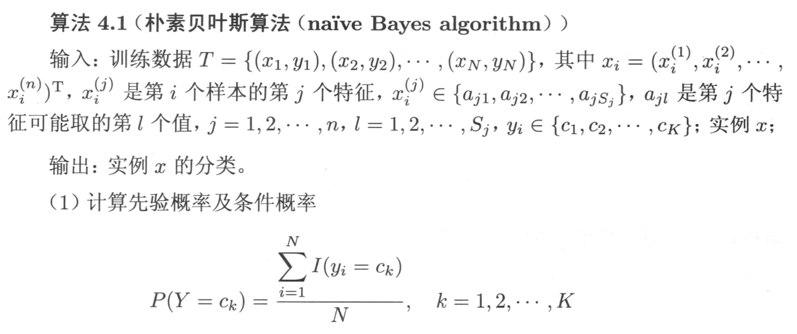
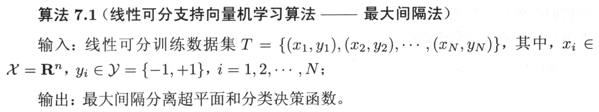

# 1 概述

## 机器学习系统的种类

*机器学习的本质：学习一个从数据X到数据Y的映射*

### 有无监督

- 监督式学习：回归、分类。**训练样本和标签的集合作为经验**
    -   线性模型、KNN、决策树、神经网络、SVM、朴素贝叶斯
    -   Boosting\Bagging等集成学习模型
- 无监督式学习：聚类、可视化和降维、异常检测、关联规则
    - Kmeans、层次聚类、谱聚类等聚类算法
    - PCA、SVD等降维方法

- 半监督式学习：大量非标注数据和少量的标记数据
- 强化学习：智能体（agent）通过行为/动作（action），获取奖励/惩罚（rewrds/panalties），存在策略。**计算机与环境互动获得经验**

### 能否动态地进行增量学习

- 在线学习（增量学习）：系统可以从传入的数据流中进行增量学习。循序渐进地给系统提供训练数据，逐步积累学习成果。整个过程通常是**离线**完成的*（不在live系统上）*，因此在线学习这个名字很容易让人误解，用增量学习更为合适。
- 离线学习（批量学习）：系统无法进行增量学习，必须使用**所有数据**进行训练。对于新数据，需要将老数据和新数据合并，然后一起重新训练一个新版本的系统，停用旧系统。

### 基于实例/模型

- 基于实例的学习：死记硬背，系统先完全记住学习示例，然后通过某种相似的度量方式将其泛化到新的实例。直到接收到预测请求才开始分类过程，通过在训练数据中查找与新实例最相似的案例来进行预测或分类。
    -   KNN

- 基于模型的学习：从一组示例集中学习出构建这些示例的模型，然后使用该模型进行预测。

## 机器学习的基本步骤

*数据和特征决定了机器学习的上界，而模型和算法只是去逼近这个上界。*

**（收集数据-输入数据-数据预处理-训练和测试模型-模型的评估）**

*加载数据-训练/测试集切分-数据预处理-创建模型-模型拟合-预测-评估模型性能-模型调整*

- 数据的分类
    - 结构化数据和非结构化数据。结构化数据是二维表结构，非结构化数据是图片、文字、语音和视频等。
    - 原始数据和加工数据。
    - 样本内数据和样本外数据。

- 数据预处理

    特征幅度较大，让特征归一到同一个范围中。

    -   标准化 $z = \frac{x-\mu}{\sigma},\mu=\frac{1}{N}\sum\limits_{i=1}^N(x_i),\sigma=\sqrt{\frac{1}{N}\sum\limits_{i=1}^N(x_i-\mu)^2}$

    -   归一化$x_{norm} = \frac{x-x_{min}}{x_{max}-x_{min}}$​

        补充：将数据归一化到$[a,b]$区间：
        $$
        k = \frac{(b-a)}{x_{max}-x_{min}} \\
        x = a + k(x-x_{min})
        $$

    特征缩放的作用：

    - 提升模型的收敛速度（加快梯度下降的求解速度）

    - 提升模型的精度（消除量级和量纲的影响）
    - 简化计算（与归一化的简化原理相同）

- 模型评估

    - 混淆矩阵

        |          | 实际正例 | 实际负例 |
        | -------- | -------- | -------- |
        | 预测正例 | TP       | FP       |
        | 预测负例 | FN       | TN       |

        T:True       F:False		机器的判断是否正确

        P:Positive N:Negative	 机器预测样本为正还是为负

    - 准确率

        $Accuracy = \frac{TP+TN}{TP+TN+FP+FN}$

        - 判断正确数量/全部数量

        - 代表了对样本整体的预测准确程度

        - **在样本不平衡的情况下，准确率会失效**

    - 精确率

        $Precision = \frac{TP}{TP+FP}$

        - 预测为正的样本中实际为正的概率

        - 代表了对正样本结果中的预测准确程度

    - 召回率（查全率）

        $Recall = \frac{TP}{TP+FN}$

        - 实际为正的样本中被预测为正的概率

        - 适用于网贷违约的坏用户检测等场景

    - F1分数

        $F1 = \frac{2 \times Precision \times Recall}{Precision + Recall}$ 

        - 精确率和召回率的加权平均数，综合考虑了精确率和召回率

            $\frac{2}{\frac{1}{Precision}+\frac{1}{Recall}}$

    - ROC曲线

        接受者操作特征曲线

    - AUC曲线

        曲线下面积

- 交叉验证法

    - 留出法

        - 按固定比例将数据集**静态**地划分为训练集、验证集、测试集

            > 对于小规模样本集（几万量级），常用的分配比例是 60% 训练集、20% 验证集、20% 测试集
            >
            > 对于大规模样本集（百万级以上），只要验证集和测试集的数量足够即可，例如有 100w 条数据，那么留 1w 验证集，1w 测试集即可。1000w 的数据，同样留 1w 验证集和 1w 测试集
            >
            > 超参数越少，或者超参数很容易调整，那么可以减少验证集的比例，更多的分配给训练集

    - 留一法

        - 每次的测试集都只有一个样本，要进行 m 次训练和预测

            这个方法用于训练的数据只比整体数据集少了一个样本，因此最接近原始样本的分布

            但是训练复杂度增加了，因为模型的数量与原始数据样本数量相同

            一般在数据缺乏时使用

    - k折交叉验证

        - **动态**地进行验证

            > 将数据集分为训练集和测试集，将测试集放在一边
            >
            > 将训练集分为 k 份
            >
            > 每次使用 k 份中的 1 份作为验证集，其他全部作为训练集。
            >
            > 通过 k 次训练后，我们得到了 k 个不同的模型。
            >
            > 评估 k 个模型的效果，从中挑选效果最好的超参数
            >
            > 使用最优的超参数，然后将 k 份数据全部作为训练集重新训练模型，得到最终模型

​				

k一般取10。

数据量小的时候，k 可以设大一点，这样训练集占整体比例就比较大，不过同时训练的模型个数也增多。

数据量大的时候，k 可以设小一点。

测试集单独拿出来，千万不能用测试数据来调参。

- 模型调整（调参）：网格搜索/随机搜索。

    如果搜索空间包含 3 到 4 个以上的维度，不要使用网格搜索。相反，使用随机搜索，它为每个搜索任务提供了非常好的基准。
    
    -   参数：参数是模型中可被学习和调整的参数，通常是通过训练数据来`自动学习`的，以`最小化损失函数或优化目标`。
    
    -   超参数：`超参数`则是在算法运行之前手动设置的参数，用于`控制模型的行为和性能`。
    
        这些超参数的选择会影响到模型的`训练速度、收敛性、容量和泛化能力`等方面。
    
        -   学习率、迭代次数、正则化参数、隐藏层的神经元数量、初始权值
        -   KNN中的K，支持向量机中的C和sigma

# 2 KNN

## KNN的工作机制

确定训练样本以及某种距离度量。对于某个给定的测试样本，找到训练集中距离最近的**K个样本**。分类问题用投票法，回归问题用平均法。还可以基于距离远近进行加权平均或加权投票，距离越近的样本权重越大。

- 投票法：选择k个样本中出现最多的类别标记作为预测结果
- 平均法：将这k个样本的实值输出标记的平均值作为预测结果
- KNN没有显式的学习过程。
- K=1时，称为最邻近算法。

## 算法过程

## 距离度量

特征空间中两个实例点的距离是两个实例点相似程度的反映。不同的距离度量所确定的最近邻点可能是不同的。

闵可夫斯基距离：$L_p(x_i,x_j) = (\sum^n_{l=1}|x_i^{(l)}-x_j^{(l)}|^p)^\frac{1}{p}$ 

$p=1$，曼哈顿距离

$p=2$，欧氏距离

$p=\infty$，切比雪夫距离。各个坐标距离的最大值。原式会变为$\max\limits_{l}|x_i^{(l)}-x_j^{(l)}|$

## K值的选择

- K值的选择会对k近邻法的结果产生重大影响

- 为了避免平票的出现，k应该选择**奇数**

- K值小：单个样本的影响越大
    - 优点：近似误差（approximation error）减小
        - 只有与输入实例较近的训练实例才会对预测结果起作用
    - 缺点：估计误差（estimation error）增大
        - 预测结果会对近邻的实例点非常敏感（易受噪声影响）

- K值大：单个样本的影响越小

    - 优点：估计误差减小

    - 缺点：近似误差增大

- 通常采用**交叉验证法**来选取最优的K值（调参）

## KD树

寻找k近邻时，可以采用线性扫描：计算输入实例与每一个训练实例的距离。复杂度$O(n)$。但当训练集很大时，计算非常耗时。

故采用**KD树**优化，提高K近邻搜索的效率。平均计算复杂度$O(\log N)$

### KD树的构造

- KD树是一棵平衡二叉搜索树。若它的左子树不空，则左子树上所有结点的值均小于它的根结点的值； 若它的右子树不空，则右子树上所有结点的值均大于它的根结点的值

> 例：
> 
> 
> 

拓展到K维，其实是一样的。

- 通常，从方差较大的轴开始选择分割点。

- KD树上的每个叶子节点可以包含多个数据点

    

### KD树的搜索

重点说一下(3)(b)如何实现。实际上这个“超球”相交，只不过是看**当前搜索维度下的当前搜索结点与目标点的距离**是否小于**全局最优距离**。若小于，则相交。

还是举上面的例子。假设我们要查找的目标点为(2,5)

1. 从根结点出发

2. 在维度1，2<7，进入左子树(5,4)。

3. 在维度2，5>4，进入右子树(4,7)

4. 在维度1，2<4，进入左子树

    左子树为空，返回(4,7)

    当前最近点(4,7)，全局最短距离2

5. 检查**父节点**，即（5,4），在**维度2**上与目标点的距离。

    为1，小于全局最短距离2。*（说明超球与超平面相交了）*

    所以在父节点的左子树中对应的空间中**可能**存在距离目标点更近的点。

    所以需要进入这个节点(2,3)，并重复上面步骤。

    

6. 当前最近点(2,3)：全局最短距离1.41

    在维度1，2>=2，进入右子树

    右子树为空，返回(2,3)

7. 返回(5,4)

8. 检查**父节点**，即（7,2），在**维度1**上与目标点的距离。

    为5，大于全局最短距离1.41。*（说明超球与超平面没有相交）*

    所以在父节点的右子树中结点对应的空间中**不可能**存在更近的点。

    

9. 以此类推，直到回到根节点（包括对根节点另一侧的判断）。

如果要找k近邻而不是最近邻，保存路程中找到的结点及距离即可。

# 3 朴素贝叶斯

## 贝叶斯原理

朴素贝叶斯公式如下
$$
P(Y|X) = P(Y)\frac{P(X|Y)}{P(X)}
$$

$$
P(Y_i|X) = P(Y_i)\frac{P(X|Y_i)}{\Sigma_{i=1}^n P(X|Y_i)P(Y_i)}
$$

$P(Y)$称为先验概率（prior probability），即在Y事件发生之前，我们对Y事件概率的一个判断；

$P(X)$边际似然度；

$P(Y|X)$称为后验概率（posterior probability），即在X事件发生之后，我们对Y事件概率的重新评估；

$P(X|Y)$​似然度。

$\frac{P(X∣Y)}{P(X)}$​ 称为可能性函数（Likely hood），这是一个调整因子，使得预估概率更接近真实概率。

所以条件概率可以理解为：后验概率 = 先验概率 × 调整因子

- 如果"可能性函数">1，意味着"先验概率"被增强，事件Y的发生的可能性变大；
- 如果"可能性函数"=1，意味着X事件无助于判断事件A的可能性；
- 如果"可能性函数"<1，意味着"先验概率"被削弱，事件Y的可能性变小。

而高斯贝叶斯是先验为高斯分布的朴素贝叶斯，假设每个标签的数据都服从简单的正态分布。
$$
P(X_j=x_j|Y=C_k)=\frac{1}{\sqrt{2\pi \sigma^2_k}}exp(-\frac{(x-\mu_k)^2}{2\sigma_k^2})
$$
其中，$C_k$为$Y$的第$k$类的类别。$\mu_k$和$\sigma_k^2$为需要从训练集估计的值。

## 基本方法

训练数据集，假设X,Y**独立同分布**（条件独立假设，朴素一词的由来 ）。

- 条件独立性假设：
    $$
    P(X|Y_i)=P(X^{(1)} = x^{(1)},...,X^{(n)}=x^{(n)}|Y=i) \\ =\mathop{\Pi}\limits_{j=1}\limits^{n} P(X^{(j)} = x^{(j)}|Y = i )
    $$
    用于分类的特征在类确定的条件下都是条件独立的。也是**朴素**一词的由来。

- 同分布：获取的观测数据是对总体的一个抽样。我们希望抽样尽可能地和总体相似，也就是服从相同的分布。即：抽样内样本服从总体的分布。

后验概率计算根据贝叶斯定理进行
$$
P(Y_i|X) = P(Y_i)\frac{P(X|Y_i)}{\Sigma_{i=1}^n\big(P(Y_i)P(X|Y_i)\big)}
$$
带入特征条件独立性假设
$$
P(Y_i|X) = P(Y_i)\frac{\mathop{\prod}\limits_{j}P(X^{(j)}=x^{(j)}|Y_i)}{\Sigma_{i=1}^n \big(P(Y_i)\mathop{\prod}\limits_{j}P(X^{(j)}=x^{(j)}|Y_i)\big)}
$$
找到使得后验概率最大的$i$作为预测的类别。
$$
y = f(x) = \arg \max\limits_i P(Y_i|X)
$$
简化形式
$$
y = \arg \max \limits_{i} P(Y=i)\prod_{j}P(X^{(j)}=x^{(j)}|Y = i)
$$

## 参数估计

在朴素贝叶斯法中，学习意味着

- 估计$P(Y=c_k)$的值

- 估计$P(X^{(j)}=x^{(j)}|Y=c_k)$​的值

## 算法过程

## 例题

### 1 计算先验概率和条件概率

### 2 计算每类概率/确定所属分类

## 贝叶斯估计

用极大似然估计可能会出现所要估计的概率值为0的情况，这时会影响到后验概率的计算结果，使分类产生偏差。解决这一问题的方法是采用贝叶斯估计。

**简单理解，就是在原来的分数上，分子+1，分母+种类的个数**

- 先验概率的贝叶斯估计
    $$
    P_\lambda(Y = c_k) = \frac{\sum\limits_{i=1}^{N}I(y_i=c_k)+\lambda}{N+K\lambda}
    $$
    $K$为类的取值个数。$N$为样本个数。$I(y_i=c_k)$表示满足括号内条件个样本个数。

- 条件概率的贝叶斯估计

$$
P_\lambda(X^{(j)}=a_{jl}|Y = c_k) = \frac{\sum\limits_{i=1}^{N}I(X^{(j)}=a_{jl}|Y = c_k)+\lambda}{\sum\limits_{i=1}^NI(y_i=c_k)+S_j\lambda}
$$

$S_j$表示特征$X^{(J)}$的所有取值个数$|A_j|$

$\lambda=0$时是极大似然估计。

$\lambda=1$时是拉普拉斯平滑。

# 4 线性回归

## 度量函数

- 损失函数：**单样本**预测的错误程度

    - 0-1损失函数、平方损失函数、绝对损失函数、对数损失函数
    - 残差平方和$RSS = \sum_{i=1}^N(f(x_i)-y_i)^2$

- 代价函数：度量**全部样本集**的平均误差

    - 均方误差、均方根误差、平均绝对误差

    - $L(w,b) = \frac{1}{2}\sum_{i=1}^N(f(x_i)-y_i)^2=\frac{1}{2}\sum_{i=1}^N(w_i\vdot x_i + b-y_i)^2$​

        注：上式仅考虑单变量$x$。实际上对于$k$个维度的变量$x$，每一个维度都会有一个$w_k$。如下面“梯度下降法”中的公式所示。

- 目标函数：代价函数和正则化函数，最终要优化的函数

    - 目标：最小化目标函数

## 回归问题的求解

### 梯度下降法

$J(w) = \frac{1}{2}\sum_{i=1}^N(f(x_i)-y_i)^2 = \frac{1}{2}\sum_{i=1}^{N}(\sum_{k=1}^nw_k\vdot x_i^{(k)}+b-y_i)$

为了让符号简化，公式更简洁，令$w_0=b,x^{(0)}=1$，则上式可变为：

$J(w) = \frac{1}{2}\sum_{i=1}^{N}(\sum_{k=0}^nw_k\vdot x_i^{(k)}-y_i)$ *消b变0*​

这样原问题就变为了**找到一个$w$，使得$J(w)$最小**​

*如果优化目标函数是凸函数，则局部极小值就是全局最小值*

#### 算法步骤

1. 初始化参数$w$

2. $w_j = w_j - \alpha\frac{\partial}{\partial w_j}J(w)$​

3. 重复直到收敛

    其中，$\frac{\partial}{\partial w_j}J(w) = \sum \limits_{i=1}^N(f(x_i)-y_i) \vdot x^{(j)}$

**注意：每个维度同步更新**

#### 三种梯度下降法

- 批量梯度下降法（BGD）：梯度下降法的最原始形式。在更新每一参数时都使用**所有的样本**来进行更新。
    - 优点：易于找到全局最优解；易于并行实现
    - 缺点：当样本数量很多时，训练过程会很慢
- 随机梯度下降法（SGD）：在更新每一参数时，都使用**一个样本**来进行更新。
    - 优点：训练速度快
    - 缺点：准确率下降，并不是全局最优；不易于并行实现
- 小批量梯度下降法（MBGD）：在更新每一参数时，用**一小部分样本**来进行更新。
    - 算法的训练过程比较快，而且也要保证最终参数训练的准确率。

#### 学习率的选择

### 最小二乘法/正规方程

将$J(w) = \frac{1}{2}\sum_{i=1}^N(f(x_i)-y_i)^2 $写作矩阵的形式。

$J(w) = \frac{1}{2}(Xw-y)^T(Xw-y)$

对$w$求偏导，得到$\frac{\partial}{\partial w}J(w) = X^TXw-X^Ty$​

$X(N \times n),w(n \times 1),y(N \times 1)$

> 相关矩阵运算公式：
>
> - $\sum\limits_i z_i^2 = z^Tz$
> - $a^Tb = b^Ta$
> - $\frac{\part}{\part x}b^Tx = b$
> - $\frac{\part}{\part x}x^TAx = 2Ax，A为对阵矩阵$​
> - $设A = X^TX，则A为对称阵$​
> - $(ab)^T = b^Ta^T$

令偏导为0，得到

$w = (X^TX)^{-1}X^Ty$

为正规方程的解析解/闭式解

### 两种方法的比较

### M次多项式回归

仅考虑$x$是一维变量的简单情况。

$f_M(x,w) = w_0 + w_1x + w_2x^2 + \cdots + w_Mx^M = \sum\limits_{j=0}^Mw_jx^j$

$L(w) = \frac{1}{2}\sum\limits_{i=1}^N(\sum\limits_{j=0}^Mw_jx^j-y_i)^2$

## 模型选择

## 正则化

- 目标：降低模型的过拟合
- 原理：在损失函数上加上某些规则（限制），缩小解空间，从而减少求出过拟合解的可能性

- 一般形式：$\min \limits_{f \in F} \frac{1}{N}\sum\limits_{i=1}^NL(y_i,f(x_i))+\lambda J(f)$

    其中，第一项是经验风险（原损失函数），第二项是正则化项。$\lambda \geq 0$​为调整两者之间关系的系数。

    也就是说，加入了正则化后的模型，要将损失函数变成上面的样子。

- 线性模型的正则化：通过约束模型的权值来实现，即模型参数向量的范数。

    越小的权值意味着函数越平滑。

    - L2：岭回归：$\lambda w^2$
    - L1：套索回归：$\lambda|w|$
    - 同时使用L1和L2：弹性网络：$\lambda|w| + (1-\lambda)w^2$​

- 注意：

    - 正则化一般是模型复杂度的单调递增函数。模型越复杂，正则化值就越大。
    - 正则化只能在训练时添加到代价函数中。测试时必须用**未经正则化的性能指标**来评估。

### L1和L2正则化项的区别

L1通常是比L2更容易得到稀疏输出的，会把一些不重要的特征直接置零。

对于L1范数（向量中各个元素绝对值之和），其图形为菱形，二维属性的等值线有4个角（高维的会有更多），“突出来的角”更容易与平方误差项进行交叉，而这些“突出来的角”都是在坐标轴上，即W1或则W2为0

而对于L2范数（向量元素的平方和再开平方），交叉点一般都是在某个象限中，很少有直接在坐标轴上交叉的。

可以直观的理解为，我们**最小化损失函数**就是**求蓝圈+红圈的和的最小值**，而这个值通在很多情况下是两个曲面相交的地方。

### 正则项的选择

- 因为L1范数正则化项的“稀疏解”特性，L1更适合用于特征选择，找出较为“关键”的特征，而把一些不那么重要的特征置为零。

- L2范数正则化项可以产生很多参数值很小的模型，也就是说这类的模型抗干扰的能力很强，可以适应不同的数据集，适应不同的“极端条件”

# 5 感知机

二分类的线性分类模型，是一个超平面。

$f(x)=sign(w\cdot x+b)$,sign表示返回括号内的数的正负号

-   感知机的学习过程就是求得w,b
-   预测过程就是通过学习到的w,b，对于新的输入实例，给出其对应的输出类别

## 损失函数

误分类点到超平面的距离。使用函数间隔作为损失函数（忽略了$-\frac{1}{||w||}$）。

### 几何距离

- 点$x_i$到超平面的距离

    $\frac{1}{||w||}|w\cdot x_i + b|$

- 误分类点

    $-y_i(w\cdot x_i + b) > 0$

- 误分类点到超平面的距离

    $-\frac{1}{||w||}y_i(w \cdot x_i + b)$

- 误分类点集合M中所有点到超平面的总距离

    $-\frac{1}{||w||}\sum\limits_{x_i\in m}y_i(w \cdot x_i + b)$​

- 几何间隔

    超平面$(w,b)$关于样本点$(x_i,y_i)$的几何间隔为

    $\gamma _i = y_i(\frac{w}{||w||}\cdot x_i + \frac{b}{||w||})$

​	超平面关于训练数据集的几何间隔为

​	$\gamma = \min\limits_{i=1,\cdots,N} \gamma_i$

### 函数距离

- 点$x_i$到超平面的距离

    $|w\cdot x_i + b|$

- 误分类点

    $-y_i(w\cdot x_i + b) > 0$

- 误分类点到超平面的距离

    $-y_i(w \cdot x_i + b)$

- 误分类点集合M中所有点到超平面的总距离

    $-\sum\limits_{x_i\in m}y_i(w \cdot x_i + b)$

- 几何间隔

    超平面$(w,b)$关于样本点$(x_i,y_i)$的几何间隔为

    $\hat\gamma _i = y_i(w\cdot x_i + b)$

​	超平面关于训练数据集的几何间隔为

​	$\hat\gamma = \min\limits_{i=1,\cdots,N} \hat\gamma_i$​

### 为什么感知机使用函数间隔？

-   在线性可分数据集上，目标是使误分类点的个数为0，是否加$-\frac{1}{||w||}$对$-y_i(w \cdot x_i + b)$​的正负判定毫无影响。
-   该方法允许有多个w值
-   不需要进行很复杂的求导，简化计算

## 基本形式

### 问题定义

代价函数定义为$L(w,b)=-\sum\limits_{x_i\in M}y_i(w\cdot x_i+b)$

其中，M为误分类点的集合。

-   损失函数非负。如果没有误分类点，损失函数值为0
-   误分类点越少/误分类点距离超平面越近，代价函数值越小

### 学习算法（随机梯度下降法）

$\grad_wL(w,b) = -y_ix_y$

$\grad_bL(w,b)=-y_i$

1.   任意选择一个超平面$w_0,b_0$
2.   随机选取一个误分类点$(x_i,y_i)$，对$w,b$进行更新（带学习率，同梯度下降，减去学习率*梯度）。
3.   条件终止：损失函数为0

### 例题

解：

## 对偶形式

- 对偶问题比原问题更容易解决或更容易计算
- 无论原优化问题的凸性如何，对偶问题始终是凸优化问题
    - 一个凸优化问题的局部最优解就是全局最优解
    - 一个优化问题的拉格朗日对偶函数一定是一个凸优化问题
- 对于感知机算法来说，对偶形式可以降低计算量

### 基本思想

将$w,b$表示为实例$x_i$和标记$y_i$的线性组合的形式，通过求解其系数而求得$w,b$​

对偶形式的优点在于可以事先计算好所有的内积（$x_j\cdot x_i$​），也就是Gram矩阵，就可以大大地加快计算速度。也就是先算内积（固定是那几个数字，存在GRAM矩阵中）再相加，避免了其他计算。Gram矩阵是沿主对角线对称的。

---

原本的w变成了$\sum\limits_{j=1}^N\alpha_jy_jx_j$，其中$\alpha = n_i\eta$

也就是说，当学习率为1时，$\alpha$的含义是样本$x$被误分类了$\alpha$次。

更新时，更新**对应维度**的$\alpha$​和全局的b。

注意关注最后的w如何从$\alpha$​得出

$w = \sum\limits_{i=1}^Nn_i\eta y_ix_i = \sum\limits_{i=1}^N \alpha_i y_ix_i$

其中$n_i$是被误分类的个数。

### 对偶例题

# 6 逻辑回归

## 模型

$z = \sigma(f(x))=\sigma(w\cdot x + b) = \frac{1}{1+e^{-(w \cdot x+b)}}$

在二分类中，设事件发生的概率为$p$，事件发生与不发生的概率之比称为事件的发生比（或称几率）。逻辑回归实际上是对数几率回归。
$$
\log \frac{p}{1-p} = w^Tx + b \\
p = \frac{1}{1+e^{-(w^Tx+b)}}
$$

## 参数估计

应用极大似然估计法估计模型参数，从而得到Logistic回归模型。

$P(Y=1|x) = \pi(x),P(Y=0|x)=1-\pi(x)$

$\pi(x)=\frac{1}{1+e^{-(w^Tx+b)}}$​

则似然函数为

$\prod\limits_{i=1}^{N}[\pi(x_i)]^{y_i}[1-\pi(x_i)]^{1-y_i}$

为了得到使似然函数最大的参数，对上式取对数，得到**对数似然函数**

$L(w) = \sum\limits_{i=1}^N[y_i\log \pi(x_i)+(1-y_i)\log(1-\pi(x_i))]$

对$L(w)$求极大值，转换为求极小值

$J(w) = -L(w) = -\sum\limits_{i=1}^N[y_i(w \cdot x_i)-\log(1+e^{w \cdot x_i})]$

求偏导

$\frac{\part J(w_j)}{\part w_j} = -\sum\limits_{i=1}^N(y_i-\pi(x_i))\cdot x_i^{(j)}$

对每个维度j进行更新

$w_j = w_j - \alpha \frac{\part J(w_j)}{\part w_j} $

## 熵

**事件发生的概率越小，信息量越大。**

定义事件的信息量为$I(x_0)=-\log(p(x_0))$​

一个生动的例子：

[一文搞懂交叉熵在机器学习中的使用，透彻理解交叉熵背后的直觉-CSDN博客](https://blog.csdn.net/tsyccnh/article/details/79163834)

用熵来表示所有信息量的**期望**。

$H(X) = -\sum\limits_{i=1}^n p(x_i)\log(p(x_i))$​

其中n是样本的种类的个数。也就是说，$p(x_i)$表示整个数据集$X$中，$x=i$的概率。

而在0-1分布中，熵的计算可以简化成如下形式

$H(X) = - \sum\limits_{i=1}^n (p(x_i)\log(p(x_i)) + (1-p(x_i))\log(1-p(x_i)))$

这时，熵随p的变化如图

当p=0或p=1时，H(p)=0，随机变量**完全没有不确定性**，信息含量最小。

**交叉熵**则作为损失函数，可以理解为预测值与真实值的“距离”。

$loss = -\sum\limits_{i=1}^ny_i\log (\hat{y_i})$

其中，$n$为种类的个数。

>   例
>
>   |       | 猫   | 青蛙 | 老鼠 |
>   | ----- | ---- | ---- | ---- |
>   | Label | 0    | 1    | 0    |
>   | Pred  | 0.3  | 0.6  | 0.1  |
>
>   那么
>
>   $loss = -(0\times \log(0.3) + 1 \times \log(0.6) + 0 \times \log(0.1))$
>
>   显然这个pred是经过softmax的

而对于二分类，loss可以简化为

$loss=-y\log(\hat{y})-(1-y)\log{(1-\hat{y})}$

这时我们惊奇的发现，上面的loss和逻辑回归的$J(w)$​是一致的！

上面的Loss仅对于一个样本，而对于所有的数据，求和除以N即可。

## 多类别分类

区分两个以上的类别。

-   多类别分类的学习方法
    -   可以直接处理多个类别：随机森林、朴素贝叶斯
    -   严格的二分类器：逻辑回归、感知机、支持向量机
-   对于严格的而分类器，需要用到拆分策略。
    -   对问题进行拆分，为拆出的每个二分类任务训练一个分类器
    -   对于每个分类器的预测结果进行集成以获得最终的多分类结果

### 拆分策略

-   一对其余(OvR)或一对全部(OvA)

    某一类作为正例，其他作为负例，形成N个二分类任务，N个二分类分类器。

    新样本提交给所有分类器预测，得到N个分类结果，将**置信度最大的类别**作为最终类别。

    -   存储开销和测试时间小
    -   训练时间长

-   一对一(OvO)

    N个类别两两配对，得到$\frac{N(N-1)}{2}$个分类任务，$\frac{N(N-1)}{2}$个二分类分类器。

    新样本提交给所有分类器预测，得到N个分类结果，将**被预测最多的类别**作为最终类别。

    -   存储开销和测试时间大
    -   训练时间短

# 7 决策树

## 条件熵

条件熵$H(Y|X)$表示，在已知随机变量$X$的条件下，随机变量$Y$的不确定性。定义为

$H(Y|X) = \sum\limits_{i=1}^np_iH(Y|X=x_i),p_i = P(X = x_i)$

>   $H(X) = - (p(x)\log(p(x)) + (1-p(x))\log(1-p(x)))$​

>   例：
>
>   
>
>   
>
>   上面的例子表明，特征2的信息熵是0，毫无作用。

## 特征选择方法

### 信息增益

#### 理解

#### 人话

-   算总的信息熵
    -   $H(X) = - (p(x_i)\log(p(x_i)) + (1-p(x_i))\log(1-p(x_i)))$
-   算每个特征的条件熵
    -   按照该特征的类别分成多个子集，n个类就分成n个子集
    -   对每个子集，算该子集的信息熵
    -   求和并**乘以概率**（该子集所占的比例），得到该特征的条件熵
-   算每个特征的信息增益
    -   总信息熵-条件熵
-   找最大

所以总共**只有一个公式**，很简单。

#### 例题

#### 缺点

偏向于选择取值数目较多的特征。

例如，假如把ID作为特征，它的信息增益将远远大于其他特征。这样的决策树不具有泛化能力，无法对新样本进行有效预测。

### 信息增益比

$g_R(D,A)=\frac{g(D,A)}{H_A(D)}$

其中$H_A(D)$是数据集$D$关于特征$A$的值的熵。也就是说，只看这一个特征，算数据集的信息熵。

### 基尼系数

样本属于第$k$类的概率为$p_k$

$Gini(p)=\sum\limits_{k=1}^Kp_k(1-p_k)=1-\sum\limits_{k=1}^Kp_k^2$

对于二分类问题，简化为

$Gini(p)=2p(1-p)$

样本集合$D$根据特征$A$是否取某一可能值$a$被分割成$D_1$和$D_2$两部分，即

$D_1 = \{(x,y) \in D|A(x)=a \},D_2 = D - D_1$

则在特征$A$的条件下，集合$D$的基尼指数定义为

$Gini(D,A) = p_1Gini(D_1) + p_2Gini(D_2)$，其中$p_1$表示子集$D_1$在$D$中出现的概率（比例）。

基尼指数表示集合D的不确定性，基尼指数值越大，样本集合的不确定性也就越大。

## 决策树的生成

### ID3算法

基于信息增益，递归构建决策树。

看下面的算法前，明确几个概念：

-   类标记：表示这个结点的最终预测的类。
-   阈值$\epsilon$：信息增益太小了，继续按照信息增益划分生成子树意义不大。
-   由于是递归调用的，刚开始建树的前几步的“若”往往不成立。
-   可以按照这个顺序看：356 (124)

简单来说，就是从根开始递归建树。

且停止标准有三条：子集中只含有一个预测类别/特征分完/信息增益小于阈值。

若满足停止标准其中之一，以当前子集中类别最多的类作为类标记；

如果不满足，找最大信息增益的特征，按照其不同取值分叉，形成子结点。子结点会成为新的树的根。

>   例：
>
>   

### C4.5算法

基于信息增益比，算法流程和ID3算法一模一样，只有选取特征的时候用信息增益比。

### CART算法

Classification And Regrassion Tree，可用于分类，也可用于回归。

决策树为二叉树，内部节点特征的取值只有“是”和“否”。左是右否。

-   回归树：平方误差最小化准则

-   分类树：基尼指数最小化准则

    算法停止计算的条件是：节点中的样本个数小于预定阈值/样本集的基尼指数小于预定阈值（样本基本属于同一类）/没有更多特征。

    

    >   例：
    >
    >    
    >
    >   

## 决策树类别

| 算法 | 支持模型       | 树结构 | 特征选择            | 连续值处理 | 缺失值处理 | 剪枝   | 特征属性多次使用 |
| ---- | -------------- | ------ | ------------------- | ---------- | ---------- | ------ | ---------------- |
| ID3  | 分类           | 多叉树 | 信息增益            | 不支持     | 不支持     | 不支持 | 不支持           |
| C4.5 | 分类           | 多叉树 | 信息增益率          | 支持       | 支持       | 支持   | 不支持           |
| CART | 分类 回归 | 二叉树 | 基尼指数 均方差 | 支持       | 支持       | 支持   | 支持             |

# 8 SVM

## 基本思想

找到一个超平面，将不同类别的数据点分开，并使得该超平面与最近的样本点之间的距离最大化。

*支持向量：离分离超平面最近的点*

*间隔最大化：支持向量离分离超平面的距离最远*

## 三种情况

### 线性可分SVM&硬间隔最大化

#### 几何间隔与函数间隔的关系

函数间隔$\hat{\gamma}$，几何间隔$\gamma$

$\gamma = \frac{\hat \gamma}{||w||} $

即，将函数间隔除以$||w||$，得到几何间隔。如果$||w|| = 1$，那么函数间隔与几何间隔相等。当超平面的参数$w,b$​成比例地改变（超平面本身不变），函数间隔也会按此比例改变，但几何间隔不变。因此我们选用几何间隔作为距离的度量。

注意感知机中使用的是函数间隔，实际上二者的目标是不一样的。感知机只需要看正负例是否正确，而SVM是真正要看距离的。为了让距离不随成比例的系数改变而改变，感知机用几何间隔，“真正的间隔”。

#### 间隔最大化

求得一个几何间隔最大的分离超平面。即：
$$
\begin{align}
\max\limits_{w,b} & ~ \gamma \\
s.t. &~ y_i(\frac{w}{||w||}\cdot x_i + \frac{b}{||w||}) \geq \gamma,i=1,2,\cdots,N \\ 
\end{align}
$$
约束条件表示，超平面到每个训练样本点的几何间隔至少为$\gamma$

##### 变形1

考虑几何间隔与函数间隔的关系，将问题改写为
$$
\begin{align}
\max\limits_{w,b} & \frac{\hat\gamma}{||w||} \\
s.t. & y_i(w\cdot x_i + b) \geq \hat \gamma,i=1,2,\cdots,N \\ 
\end{align}
$$

##### 变形2

使$\hat\gamma=1$。函数间隔$\hat\gamma$的取值不会影响最优化问题的解。
$$
\begin{align}
\max\limits_{w,b} & \frac{1}{||w||} \\
s.t. & y_i(w\cdot x_i + b) \geq 1,i=1,2,\cdots,N \\ 
\end{align}
$$

##### 变形3

最大化$\frac{1}{||w||}$相当于最小化$||w||$
$$
\begin{align}
\min\limits_{w,b} & ||w|| \\
s.t. & y_i(w\cdot x_i + b) \geq 1,i=1,2,\cdots,N \\ 
\end{align}
$$

##### 变形4

为了方便求导，将$\min\limits_{w,b}||w||$ 变为$\min\limits_{w,b} \frac{1}{2}||w||^2$
$$
\begin{align}
\min\limits_{w,b} & \frac{1}{2}||w||^2 \\
s.t. & y_i(w\cdot x_i + b) \geq 1,i=1,2,\cdots,N \\ 
\end{align}
$$
**线性可分训练数据集的最大间隔分离超平面是存在且唯一的。**

---

$间隔=\frac{2}{||w||}$

#### 例题

#### 对偶问题

- 对偶问题比原问题更容易解决或更容易计算
- 无论原优化问题的凸性如何，对偶问题始终是凸优化问题
    - 一个凸优化问题的局部最优解就是全局最优解
    - 一个优化问题的拉格朗日对偶函数一定是一个凸优化问题

>   以下内容不考
>
>   ## 计算过程
>
>   ### 带约束问题转化为无约束问题
>
>   - 通过拉格朗日函数进行转换
>       $$
>       \begin{align}
>       \min\limits_{w,b} & \frac{1}{2}||w||^2 \\
>       s.t. & y_i(w\cdot x_i + b) \geq 1,i=1,2,\cdots,N \\ 
>       \end{align}
>       $$
>       将$(54)$写作$y_i(w\cdot x_i + b) -1 \geq 0,i=1,2,\cdots,N$
>
>       转化为：
>       $$
>       \begin{align}
>       L(w,b,\alpha) & = \frac{1}{2}||w||^2  -  \left[\sum\limits_{i=1}^N\alpha_i[y_i(w \cdot x_i + b )-1]\right] \\
>       & = \frac{1}{2}||w||^2 - \sum\limits_{i=1}^N\alpha_iy_i(w \cdot x_i + b )+\sum\limits_{i=1}^N\alpha_i
>       \end{align}
>       $$
>       则原问题变为
>       $$
>       \begin{align}
>       \min\limits_{w,b}\max\limits_{a}L(w,b,\alpha) \\
>       s.t. a_i \leq 0, i = 1,2,\cdots,N
>       \end{align}
>       $$
>       对$y_i (w⋅x_i+b)-1$的取值不再约束
>
>   ### 转换为强对偶问题
>
>   $$
>   \max \limits_\alpha \min \limits_{w,b} L(w,b,\alpha) \\
>   s.t. a_i \geq 0, i = 1,2,\cdots,N
>   $$
>
>   ### 求极小
>
>   拉格朗日函数分别对$w,b$求偏导并令其等于0
>
>   得
>   $$
>   w = \sum \limits_{i=1}^N \alpha_i y_ix_i \\ \sum\limits_{i=1}^N\alpha_iy_i=0
>   $$
>   带入拉格朗日函数并求解，得到
>   $$
>   \min \limits_{w,b}L(w,b,\alpha) = -\frac{1}{2}\sum\limits_{i=1}^N\sum\limits_{j=1}^N\alpha_i\alpha_jy_iy_j(x_i \cdot x_j) + \sum\limits_{i=1}^N\alpha_i
>   $$
>
>   ### 求极大
>
>   对$\min\limits_{w,b}L(w,b,\alpha)$对$\alpha$的极大，即是对偶问题
>   $$
>   \max  -\frac{1}{2}\sum\limits_{i=1}^N\sum\limits_{j=1}^N\alpha_i\alpha_jy_iy_j(x_i \cdot x_j) + \sum\limits_{i=1}^N\alpha_i \\
>   s.t. \sum\limits_{i=1}^N\alpha_iy_i = 0 \\
>   \alpha_i \geq 0,i=1,2,\cdots ,N
>   $$
>

### 线性SVM&软间隔最大化

当两组数据是完全线性可分，我们可以找出一个决策边界使得训练集上的分类误差为0，这两种数据就被称为是存在”硬间隔“的。

当两组数据几乎是完全线性可分的，但决策边界在训练集上存在较小的训练误差，这两种数据就被称为是存在”软间隔“。引入松弛变量C。

### 非线性SVM&核函数

使用核函数解决低维度线性不可分问题。

# 9 集成学习

## Bagging

-   个体学习器不存在强依赖关系
-   并行

-   时间复杂度低
-   自助采样法

-   假定基学习器的计算复杂度为O(m)，采样与投票/平均过程的复杂度为O(s)，则bagging的复杂度大致为T(O(m)+O(s))

-   由于O(s)很小且T是一个不大的常数，因此训练一个bagging集成与直接使用基学习器的复杂度同阶

随机森林是bagging的一个扩展变种，以决策树为基学习器构建bagging的基础上，进一步在决策树的训练中引入了随机属性选择。

## Boosting

-   个体学习器存在强依赖关系

-   串行

-   每次调整训练数据的样本分布

    

    

    

    ### AdaBoost算法

    1.   初始化样本权重。$w=1/m$，$D_t$是表示第$t$轮时权重的**分布**。

    2.   进行T轮训练

         1.   选取当前误差率最低的弱分类器$h_t$

         2.   计算误差$e_t = \sum\limits_{i=1}^N w_{ti}I(h_t(x_i) \neq y_i)$

         3.   计算该弱分类器权重$\alpha_t = \frac{1}{2}\ln(\frac{1-e_t}{e_t})$​

              弱分类器权重对误差的图像

              

         4.   更新样本权重分布，其中归一化常数$Z_t = 2\sqrt{e_t(1-e_t)}$​

    3.   按权值组合各分类器

         $f(x) = \sum\limits_{t=1}^T\alpha_th_t(x)$

         $H(x) = sign(f(x))$​

    

    

    

    

    第一轮训练

    

## Stacking

并行+串行。前一个模型的推理结果，作为下一个模型的输入特征之一。

1.   将训练数据集划分为多个子集，通常是两个或更多个。
2.   对于每个子集，使用不同的基础模型进行训练和预测，得到每个基础模型的预测结果。
3.   将这些预测结果作为新的特征，组合成一个新的训练数据集。
4.   使用这个新的训练数据集来训练一个元模型，例如逻辑回归、决策树等。
5.   最后，使用训练好的元模型来对测试数据进行预测。

# 10 K-means

-   基于样本集合划分的聚类算法。

-   将样本集合划分为k个子集，构成k个类，将n个样本分到k个类中，每个样本到其所属类的中心的距离最小。

-   每个样本只能属于一个类，所以k均值聚类是硬聚类。

-   k均值聚类的最优解求解问题是NP困难问题。现实中采用迭代的方法求解。

    

算法特性：

-   基于划分的聚类方法

-   类别数k事先指定，可以尝试使用不同的k值聚类，聚类结果的质量可以用类的平均直径来衡量。一般而言，类别数变小时，平均直径会增加。类别数变大超过某个值时，平均直径不变，这个值正是最优的k值。

    

-   以欧氏距离平方表示样本之间的距离（也可使用其他距离），以中心或样本的均值表示类别

-   以样本和其所属类的中心之间的距离的总和为最优化的目标函数

-   得到的类别是平坦的、非层次化的

-   算法是迭代算法，不能保证得到全局最优，初始中心的选择会直接影响聚类结果。
-   选择不同的初始中心，会得到不同的聚类结果。可以用层次聚类对样本进行聚类，得到k个类时停止。然后从每个类中选取一个与中心距离最近的点。

## 性能评估

-   **有分类标签**的数据集

    -   使用**兰德指数**（ARI，Adjusted Rand Index）

    -   计算真实标签与聚类标签两种分布相似性之间的相似性，取值范围为[0,1]

    -   1表示最好的结果，即聚类类别和真实类别的分布完全一致

-   **没有分类标签**的数据集

    -   使用**轮廓系数**（Silhouette Coefficient）来度量聚类的质量

    -   轮廓系数同时考虑聚类结果的簇内凝聚度和簇间分离度

    -   取值范围：[-1,1]，轮廓系数越大，聚类效果越好

## 与KNN对比

-   相同：

    -   K值都是重点

    -   都需要计算平面中点的距离

-   相异：

    -   Knn和Kmeans的核心都是通过计算空间中点的距离来实现目的，只是他们的目的是不同的。KNN的最终目的是分类，而Kmeans的目的是给所有距离相近的点分配一个类别，也就是聚类。

    -   简单说，就是画一个圈，KNN是让进来圈子里的人变成自己人，Kmeans是让原本在圈内的人归成一类人。

# 11 PCA

模型的性能会**随着特征的增加先上升后下降。**

**不存在完全无损的降维**

## 为什么要降维

-   高维数据增加了运算的难度

-   高维使得学习算法的泛化能力变弱（例如，在最近邻分类器中，样本复杂度随着维度成指数增长），维度越高，算法的搜索难度和成本就越大。

-   降维能够增加数据的可读性，利于发掘数据的有意义的结构

## PCA原理

保留一个轴的时候，希望保留的信息最多。那么找到数据分布最分散的方向（方差最大）作为主成分。

第一个新坐标轴选择是原始数据中方差最大的方向，第二个新坐标轴选取是与第一个坐标轴正交的平面中使得方差最大的，第三个轴是与第1,2个轴正交的平面中方差最大的。依次类推，可以得到n个这样的坐标轴。

通过这种方式获得的新的坐标轴，大部分方差都包含在前面k个坐标轴中，后面的坐标轴所含的方差几乎为0。

于是，我们可以忽略余下的坐标轴，只保留前面k个含有绝大部分方差的坐标轴。这相当于只保留包含绝大部分方差的维度特征，而忽略包含方差几乎为0的特征维度，实现对数据特征的降维处理。

### 如何找到主成分方向

特征值最大的K个特征组成的矩阵进行相乘。

1. 计算数据矩阵的**协方差矩阵**

    

2.   得到**协方差矩阵的特征值和特征向量**

     

     

3.   选择特征值最大(即方差最大)的k个特征所对应的特征向量组成的矩阵

4.   这样就可以将数据矩阵转换到新的空间当中，实现数据特征的降维
