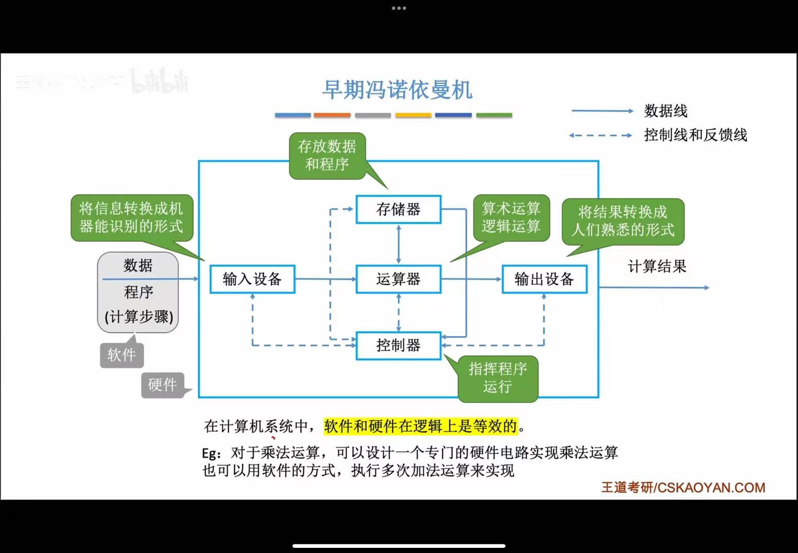

# 冯诺依曼思想

冯诺依曼型思想：存储程序、按地址自动执行。

-   存储程序：指令以二进制代码的形式事先输入计算机的主存储器
-   自动执行：按其在存储器中的首地址执行程序的第一条指令，之后按规定顺序执行其他指令，直至程序执行结束

# 冯诺依曼架构

传统冯诺依曼以**运算器**为中心。

*（现代计算机以**存储器**为中心）*

# 五大组成部分

## 运算器

- 功能：处理所有的**算数**及**逻辑**运算
- 特点：采用二进制数据进行运算
- 构成：由ALU（算术逻辑单元）和各类通用寄存器构成。

## 存储器

- 功能：保存所有的程序和数据

- 特点：二进制形式保存程序和数据；存储器是按存储单元组织的，读写存储单元必须给出单元地址。

- 相关概念

    - 存储元：用于保存一位0/1二进制数据的物理器件
    - 存储单元：每个存储单元存放一串二进制代码，由存储元组成
    - 存储字word：存储单元中二进制代码的组合
    - 存储字长：存储单元中二进制代码的位数
    - 单元地址：能够区分每一个存储单元的编号，一般从0开始编号
    - 存储容量：一个存储器所能保存的二进制信息的总量

- 分类

    - 外存（辅助存储器）：如磁盘存储器、光盘存储器；CPU不可直接访问
    - 内存（主存储器）：半导体存储器；CPU直接访问，存放当前系统运行所需的所有程序和数据

- 两个与主存相关的寄存器

    - MAR（存储器地址寄存器）：接收由**CPU**送来的地址信息。

        例：MAR为4位，则共有$2^4$个存储单元

    - MDR（存储器数据寄存器）：作为外界与存储器的数据通路。

        例：MDR为16位，则每个存储单元可存放16bit，1个字=16bit。

## 控制器

- 功能：根据所要执行指令的功能，按顺序发出各种控制命令，协调计算机的各个部件的工作。

- 构成
    - CU：控制单元，分析指令，给出控制信号。

    - IR：指令寄存器，存放当前执行的指令。

    - PC：程序计数器，存放下一条指令地址，自动+1。

- 主要任务
    - 解释并执行指令
    - 控制指令的执行程序
    - 负责指令执行过程中，操作数的寻址
    - 根据指令的执行，协调相关部件的工作，如运算类指令执行时对标志寄存器的影响设置
- 指令的形式
    - 操作码：指出指令所进行的操作，如加、减、数据传送等
    - 地址码：指出进行以上操作的数据存放位置

*运算器+控制器=CPU*

## 适配器与输入输出设备

- 输入设备：将人们熟悉的某种信息形式变换为机器内部所能接收和识别的二进制信息形式的设备。
- 输出设备：把计算机的处理结果变成人或其他机器设备所能接收和识别的信息形式的设备。

- 适配器：保证外围设备用计算机系统特性要求的形式发送或接收信息。
- 系统总线：构成计算机系统的骨架，是多个系统部件之间进行数据传送的公共通路。

# 计算机系统层次结构

计算机由5个以上不同的级组成，每一级都能进行程序设计。

| 级别 |     名称     |            对应            |
| :--: | :----------: | :------------------------: |
| 5级  |  高级语言级  |          编译程序          |
| 4级  |  汇编语言级  |          汇编程序          |
| 3级  |  操作系统级  |          操作系统          |
| 2级  |  一般机器级  | 微程序，执行二进制机器指令 |
| 1级  | 微程序设计级 |       直接由硬件执行       |

# 硬件与软件的逻辑等价性

任何操作可以由软件来实现，也可以由硬件来实现；任何指令的执行可以由硬件完成，也可以由软件来完成。

固件：功能上是软件，形态上是硬件